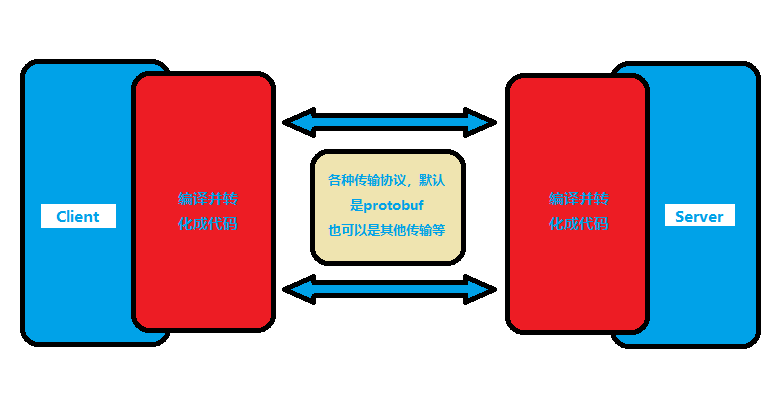

# GRPC

## GRPC介绍

### 微服务

#### 单体架构

1. 一旦某个服务宕机，会引起整个应用不可用，隔离性差
2. 只能整体应用进行伸缩，浪费资源，可伸缩性差
3. 代码辗合在一起，可维护性差

微服务架构：解决了单体架构的弊端

但同时引入了新的问题

1. 代码冗余
2. 服务和服务之间存在调用关系

服务拆分后，服务和服务之间发生的是进程和进程之间的调用，服务器和服务器之间的调用。

那么就需要发起网络调用，网络调用我们能立马想起的就是http，但是在微服务架构中，http虽然便捷方便，但性能较低，这时候就需要引入
RPC(远程过程调用)，通过自定义协议发起TCP调用，来加快传输效率。

[gRPC官方文档](https://grpc.io/)

[gRPC 官方文档中文版_V1.0 (oschina.net)](http://doc.oschina.net/grpc)

RPC的全称是Remote Procedure Call ，远程过程调用，这是一种协议，是用来屏蔽分布式计算中的各种调用细节，使得你可以像是本地调用一样直接调用一个远程的函数。

客户端与服务端沟通的过程

1. 客户端 发送 数据 (以字节流的方式)
2. 服务端 接收并且解析，根据约定 知道要执行什么。然后把结果返回给客户

RPC：

1. RPC就是将上述过程封装下，使得操作更加优化
2. 使用一些大家都认可得协议，使其规范化
3. 做成一些框架，直接或间接产生利益

而gRPC又是什么呢？用官方得话来解释：

A high performance, open source universal RPC framework.

一个高性能、开源的通用RPC框架

在gRPC中，我们称调用方为client,被调用方为server。跟其他的RPC框架一样，gRPC也是基于"服务定义"的思想。简单的来讲，就是我们通过
某种方式来描述一个服务，这种描述方式是语言无关的。在这个“服务定义“的过程中，我们描述了我们提供的服务服务名是什么，有哪些方法可以
被调用，这些方法有什么样的入参，有什么样的回参。

也就是说，在定义好了这些服务、这些方法之后，gRPC会屏蔽底层的细节，client只需要直接调用定义好的方法，就能拿到预期的返回结果。对于server端来说，还需要实现我们定义的方法。同样的，gRPC也会帮我们屏蔽底层的细节，我们只需要实现所定义的方法的具体逻辑即可。

你可以发现，在上面的描述过程中，所谓的"服务定义“，就跟定义接口的语义是很接近的。我更愿意理解为这是一种"约定“，双方约定好接口，然后server实现这个接口，client调用这个接口的代理对象。至于其他的细节，交给gRPC。

此外，gRPC还是语言无关的。你可以用C++作为服务端，使用Golang、Java等作为客户端。为了实现这一点，我们在"定义服务“和在编码和解码的过程中，应该是做到语言无关的。


因此gRPC使用了Protocol Buffss，这是谷歌开源得一套成熟得数据结构序列化机制。

你可以把他当成一个代码生成工具以及序列化工具。这个工具可以把我们定义的方法，转换成特定语言的代码。比如你定义了一种类型的参数，他会帮你转换成Golang中的struct结构体，你定义的方法，他会帮你转换成func函数。此外，在发送请求和接受响应的时候，这个工具还会完成对应的编码和解码工作，将你即将发送的数据编码成gRPC能够传输的形式，又或者将即将接收到的数据解码为编程语言能够理解的数据格式。

序列化：将数据结构或对象转换成二进制串的过程

反序列化：将在序列化过程中所产生的二进制串转换成数据结构或者对象的过程

protobuf是谷歌开源的一种数据格式，适合高性能，对响应速度有要求的数据传输场景。因为protobuf是二进制数据格式，需要编码和解码。数据本身不具有可读性。因此只能反序列化之后得到真正可读的数据。

优势

1. 序列化后体积相比JSON和XML很小，适合网络传输
2. 支持跨平台多语言
3. 消息格式升级和兼容性还不错
4. 序列化反序列化速度很快

## 安装Protobuf

### 下载[protocol buffers](https://github.com/protocolbuffers/protobuf/releases)

Protocol buffers，通常称为Protobuf，是Google开发得一种协议，用于允许对结构化数据进行序列化和反序列化。它在开发程序以通过网络相互通信或存储数据时很有用。谷歌开发它得目的是提高了一种比XML和JSON更加方便得方式来通信。

我们将找到所有系统得所有zip文件，基于我们的操作系统位版本( 64位或 32 位)，来下载指定的版本，解压压缩包后将bin目录添加到环境变量中即可

### 安装gRPC的核心库

```bash
go get google.golang.org/grpc
```

上面安装的是protocol编译器。它可以生成各种不同的代码。因此，除了这个编译器，我们还需要配合各个语言代码的生成工具，对于Golang来说，称为protoc-gen-go。不过这里有个小小的坑，github.com/golang/protobuf/protoc-gen-go和google.golang.org/protobuf/cmd/protoc是不同的，区别在于前者是旧版本，后者是google接管后的新版本，他们之间的API是不同的，也就是说用来生成的命令，以及生成的文件都是不一样的。因为目前的gRPC-go源码中的example用的是后者的生成方式，为了与时俱进，我们也采用最新的方式，你需要安装两个库：

```bash
go install google.golang.org/protobuf/cmd/protoc-gen-go@latest
go install google.golang.org/grpc/cmd/protoc-gen-go-grpc@latest
```

执行以上两句命令后会在GoPATH下的bin目录下生成对应的可执行文件

## Proto文件编写

```protobuf
// 这是在说明我们使用的是proto3语法
syntax = "proto3";

// 这部分的内容是关于最后生成的go文件是处于哪个包中， .代表当前目录生成， service代表了生成的go文件的包名是service。
option go_package = ".;service";

// 然后需要定义一个服务，在这个服务中需要有一个方法，这个方法可以接受客户端的参数，再放回服务端的响应。
// 其实很容易可以看出，我们定义了一个server，称为SayHello，这个服务中有一个rpc方法，名为SayHello。
service SayHello {
  rpc SayHello(HelloRequest) returns (HelloResponse){}
}

// message 关键字，其实可以理解为Golang中的结构体。
// 这里比较特别的是变量后面的“赋值”，注意，这里并不是赋值，而是再定义这个变量在这个message中的位置。
message HelloRequest {
  string requestName = 1;
  int64 age = 2;
}

message HelloResponse {
  string responseMsg = 1;
}
```

在编写完上面的内容后，在helloword/proto目录下执行以下的命令：

```bash
protoc --go_out=. hello.proto
protoc --go-grpc_out=. hello.proto
```

## Proto文件介绍

### message

message：protobuf中定义一个消息类型式是通过关键字message字段指定的，消息就是需要传输的数据格式的定义。	

message关键字类似于C++ 中的class，Java中的class，go中的struct。

在消息中承载的数据分别对应于每一个字段，其中每个字段都有一个名字和类型。

一个proto文件中可以定义多个消息类型。

### 字段规则

required：消息体中必填的字段，不设置会导致编码异常。在protobuf2中使用，在protobuf3中被删去。

optionl：消息体中可选字段。protobuf3没了required，optional等说明关键字，都默认为optional。

repeated：消息体中重复字段，重复的值的顺序会被保留在go中重复的会被定义为切片。

### 消息号

在消息的定义中，每个字段都必须有一个唯一的标识号，标识号是[1, 2^29-1]范围内的一个整数。

### 嵌套消息

可以在其它消息类型中定义、使用消息类型，在下面的例子中，person消息会定义在PersonInfo消息内

```protobuf
message PersionInfo {
	message Person {
		string name = 1;
		int32 heigth = 3;
		repeated int32 weight = 3;
	}
	repeated Person info = 1;
}
```

在父消息类型的外部调用这个消息类型，需要PersonInfo.Person的形式使用它，如下所示：

```protobuf
message PersonMessage {
	PersonIon.Person info = 1;
}
```

### 服务定义

如果想将消息类型作用在RPC系统中，可以在. proto文件中定义一个RPC服务接口，protocol buffer编译器将会根据所选择的不同语言生成服务接口代码以及存根。

```protobuf
service SearchService {
	// rpc 服务函数名(参数) 返回 (返回参数)
	rpc Search(SearchRequest) returns (SearchResponse)
}
```

上诉代表表示，定义了一个RPC服务，该方法接受SearchRequest返回SearchResponse

## 服务端编写

- 创建gRPC Server对象，可以理解为它是Server端的抽象对象

- 将Server（其包含需要被调用的服务端端口）注册到gRPC Server的内部注册中心。

  这样在接受到请求时，通过内部的服务发现，发现该服务端口并转接进行逻辑处理

- 创建Listen，监听TCP端口

- gRPC Server开始lit.Accept，直到Stop

`hello.proto`

```protobuf
// 这是在说明我们使用的是proto3语法
syntax = "proto3";

// 这部分的内容是关于最后生成的go文件是处于哪个包中， .代表当前目录生成， service代表了生成的go文件的包名是service。
option go_package = ".;service";

// 然后需要定义一个服务，在这个服务中需要有一个方法，这个方法可以接受客户端的参数，再放回服务端的响应。
// 其实很容易可以看出，我们定义了一个server，称为SayHello，这个服务中有一个rpc方法，名为SayHello。
service SayHello {
  rpc SayHello(HelloRequest) returns (HelloResponse){}
}

// message 关键字，其实可以理解为Golang中的结构体。
// 这里比较特别的是变量后面的“赋值”，注意，这里并不是赋值，而是再定义这个变量在这个message中的位置。
message HelloRequest {
  string requestName = 1;
//  int64 age = 2;
}

message HelloResponse {
  string responseMsg = 1;
}
```

`hello.pb.go`

```go
// 这是在说明我们使用的是proto3语法

// Code generated by protoc-gen-go. DO NOT EDIT.
// versions:
// 	protoc-gen-go v1.28.1
// 	protoc        v3.21.9
// source: hello.proto

package service

import (
	protoreflect "google.golang.org/protobuf/reflect/protoreflect"
	protoimpl "google.golang.org/protobuf/runtime/protoimpl"
	reflect "reflect"
	sync "sync"
)

const (
	// Verify that this generated code is sufficiently up-to-date.
	_ = protoimpl.EnforceVersion(20 - protoimpl.MinVersion)
	// Verify that runtime/protoimpl is sufficiently up-to-date.
	_ = protoimpl.EnforceVersion(protoimpl.MaxVersion - 20)
)

// message 关键字，其实可以理解为Golang中的结构体。
// 这里比较特别的是变量后面的“赋值”，注意，这里并不是赋值，而是再定义这个变量在这个message中的位置。
type HelloRequest struct {
	state         protoimpl.MessageState
	sizeCache     protoimpl.SizeCache
	unknownFields protoimpl.UnknownFields

	RequestName string `protobuf:"bytes,1,opt,name=requestName,proto3" json:"requestName,omitempty"` //  int64 age = 2;
}

func (x *HelloRequest) Reset() {
	*x = HelloRequest{}
	if protoimpl.UnsafeEnabled {
		mi := &file_hello_proto_msgTypes[0]
		ms := protoimpl.X.MessageStateOf(protoimpl.Pointer(x))
		ms.StoreMessageInfo(mi)
	}
}

func (x *HelloRequest) String() string {
	return protoimpl.X.MessageStringOf(x)
}

func (*HelloRequest) ProtoMessage() {}

func (x *HelloRequest) ProtoReflect() protoreflect.Message {
	mi := &file_hello_proto_msgTypes[0]
	if protoimpl.UnsafeEnabled && x != nil {
		ms := protoimpl.X.MessageStateOf(protoimpl.Pointer(x))
		if ms.LoadMessageInfo() == nil {
			ms.StoreMessageInfo(mi)
		}
		return ms
	}
	return mi.MessageOf(x)
}

// Deprecated: Use HelloRequest.ProtoReflect.Descriptor instead.
func (*HelloRequest) Descriptor() ([]byte, []int) {
	return file_hello_proto_rawDescGZIP(), []int{0}
}

func (x *HelloRequest) GetRequestName() string {
	if x != nil {
		return x.RequestName
	}
	return ""
}

type HelloResponse struct {
	state         protoimpl.MessageState
	sizeCache     protoimpl.SizeCache
	unknownFields protoimpl.UnknownFields

	ResponseMsg string `protobuf:"bytes,1,opt,name=responseMsg,proto3" json:"responseMsg,omitempty"`
}

func (x *HelloResponse) Reset() {
	*x = HelloResponse{}
	if protoimpl.UnsafeEnabled {
		mi := &file_hello_proto_msgTypes[1]
		ms := protoimpl.X.MessageStateOf(protoimpl.Pointer(x))
		ms.StoreMessageInfo(mi)
	}
}

func (x *HelloResponse) String() string {
	return protoimpl.X.MessageStringOf(x)
}

func (*HelloResponse) ProtoMessage() {}

func (x *HelloResponse) ProtoReflect() protoreflect.Message {
	mi := &file_hello_proto_msgTypes[1]
	if protoimpl.UnsafeEnabled && x != nil {
		ms := protoimpl.X.MessageStateOf(protoimpl.Pointer(x))
		if ms.LoadMessageInfo() == nil {
			ms.StoreMessageInfo(mi)
		}
		return ms
	}
	return mi.MessageOf(x)
}

// Deprecated: Use HelloResponse.ProtoReflect.Descriptor instead.
func (*HelloResponse) Descriptor() ([]byte, []int) {
	return file_hello_proto_rawDescGZIP(), []int{1}
}

func (x *HelloResponse) GetResponseMsg() string {
	if x != nil {
		return x.ResponseMsg
	}
	return ""
}

var File_hello_proto protoreflect.FileDescriptor

var file_hello_proto_rawDesc = []byte{
	0x0a, 0x0b, 0x68, 0x65, 0x6c, 0x6c, 0x6f, 0x2e, 0x70, 0x72, 0x6f, 0x74, 0x6f, 0x22, 0x30, 0x0a,
	0x0c, 0x48, 0x65, 0x6c, 0x6c, 0x6f, 0x52, 0x65, 0x71, 0x75, 0x65, 0x73, 0x74, 0x12, 0x20, 0x0a,
	0x0b, 0x72, 0x65, 0x71, 0x75, 0x65, 0x73, 0x74, 0x4e, 0x61, 0x6d, 0x65, 0x18, 0x01, 0x20, 0x01,
	0x28, 0x09, 0x52, 0x0b, 0x72, 0x65, 0x71, 0x75, 0x65, 0x73, 0x74, 0x4e, 0x61, 0x6d, 0x65, 0x22,
	0x31, 0x0a, 0x0d, 0x48, 0x65, 0x6c, 0x6c, 0x6f, 0x52, 0x65, 0x73, 0x70, 0x6f, 0x6e, 0x73, 0x65,
	0x12, 0x20, 0x0a, 0x0b, 0x72, 0x65, 0x73, 0x70, 0x6f, 0x6e, 0x73, 0x65, 0x4d, 0x73, 0x67, 0x18,
	0x01, 0x20, 0x01, 0x28, 0x09, 0x52, 0x0b, 0x72, 0x65, 0x73, 0x70, 0x6f, 0x6e, 0x73, 0x65, 0x4d,
	0x73, 0x67, 0x32, 0x37, 0x0a, 0x08, 0x53, 0x61, 0x79, 0x48, 0x65, 0x6c, 0x6c, 0x6f, 0x12, 0x2b,
	0x0a, 0x08, 0x53, 0x61, 0x79, 0x48, 0x65, 0x6c, 0x6c, 0x6f, 0x12, 0x0d, 0x2e, 0x48, 0x65, 0x6c,
	0x6c, 0x6f, 0x52, 0x65, 0x71, 0x75, 0x65, 0x73, 0x74, 0x1a, 0x0e, 0x2e, 0x48, 0x65, 0x6c, 0x6c,
	0x6f, 0x52, 0x65, 0x73, 0x70, 0x6f, 0x6e, 0x73, 0x65, 0x22, 0x00, 0x42, 0x0b, 0x5a, 0x09, 0x2e,
	0x3b, 0x73, 0x65, 0x72, 0x76, 0x69, 0x63, 0x65, 0x62, 0x06, 0x70, 0x72, 0x6f, 0x74, 0x6f, 0x33,
}

var (
	file_hello_proto_rawDescOnce sync.Once
	file_hello_proto_rawDescData = file_hello_proto_rawDesc
)

func file_hello_proto_rawDescGZIP() []byte {
	file_hello_proto_rawDescOnce.Do(func() {
		file_hello_proto_rawDescData = protoimpl.X.CompressGZIP(file_hello_proto_rawDescData)
	})
	return file_hello_proto_rawDescData
}

var file_hello_proto_msgTypes = make([]protoimpl.MessageInfo, 2)
var file_hello_proto_goTypes = []interface{}{
	(*HelloRequest)(nil),  // 0: HelloRequest
	(*HelloResponse)(nil), // 1: HelloResponse
}
var file_hello_proto_depIdxs = []int32{
	0, // 0: SayHello.SayHello:input_type -> HelloRequest
	1, // 1: SayHello.SayHello:output_type -> HelloResponse
	1, // [1:2] is the sub-list for method output_type
	0, // [0:1] is the sub-list for method input_type
	0, // [0:0] is the sub-list for extension type_name
	0, // [0:0] is the sub-list for extension extendee
	0, // [0:0] is the sub-list for field type_name
}

func init() { file_hello_proto_init() }
func file_hello_proto_init() {
	if File_hello_proto != nil {
		return
	}
	if !protoimpl.UnsafeEnabled {
		file_hello_proto_msgTypes[0].Exporter = func(v interface{}, i int) interface{} {
			switch v := v.(*HelloRequest); i {
			case 0:
				return &v.state
			case 1:
				return &v.sizeCache
			case 2:
				return &v.unknownFields
			default:
				return nil
			}
		}
		file_hello_proto_msgTypes[1].Exporter = func(v interface{}, i int) interface{} {
			switch v := v.(*HelloResponse); i {
			case 0:
				return &v.state
			case 1:
				return &v.sizeCache
			case 2:
				return &v.unknownFields
			default:
				return nil
			}
		}
	}
	type x struct{}
	out := protoimpl.TypeBuilder{
		File: protoimpl.DescBuilder{
			GoPackagePath: reflect.TypeOf(x{}).PkgPath(),
			RawDescriptor: file_hello_proto_rawDesc,
			NumEnums:      0,
			NumMessages:   2,
			NumExtensions: 0,
			NumServices:   1,
		},
		GoTypes:           file_hello_proto_goTypes,
		DependencyIndexes: file_hello_proto_depIdxs,
		MessageInfos:      file_hello_proto_msgTypes,
	}.Build()
	File_hello_proto = out.File
	file_hello_proto_rawDesc = nil
	file_hello_proto_goTypes = nil
	file_hello_proto_depIdxs = nil
}

```

hello_grpc.pb.go

```go
// Code generated by protoc-gen-go-grpc. DO NOT EDIT.
// versions:
// - protoc-gen-go-grpc v1.2.0
// - protoc             v3.21.9
// source: hello.proto

package service

import (
	context "context"
	grpc "google.golang.org/grpc"
	codes "google.golang.org/grpc/codes"
	status "google.golang.org/grpc/status"
)

// This is a compile-time assertion to ensure that this generated file
// is compatible with the grpc package it is being compiled against.
// Requires gRPC-Go v1.32.0 or later.
const _ = grpc.SupportPackageIsVersion7

// SayHelloClient is the client API for SayHello service.
//
// For semantics around ctx use and closing/ending streaming RPCs, please refer to https://pkg.go.dev/google.golang.org/grpc/?tab=doc#ClientConn.NewStream.
type SayHelloClient interface {
	SayHello(ctx context.Context, in *HelloRequest, opts ...grpc.CallOption) (*HelloResponse, error)
}

type sayHelloClient struct {
	cc grpc.ClientConnInterface
}

func NewSayHelloClient(cc grpc.ClientConnInterface) SayHelloClient {
	return &sayHelloClient{cc}
}

func (c *sayHelloClient) SayHello(ctx context.Context, in *HelloRequest, opts ...grpc.CallOption) (*HelloResponse, error) {
	out := new(HelloResponse)
	// 可以直接在这里的实现SayHello的业务逻辑
	// 或者在此定义一个扩展的类即可
	err := c.cc.Invoke(ctx, "/SayHello/SayHello", in, out, opts...)
	if err != nil {
		return nil, err
	}
	return out, nil
}

// SayHelloServer is the server API for SayHello service.
// All implementations must embed UnimplementedSayHelloServer
// for forward compatibility
type SayHelloServer interface {
	SayHello(context.Context, *HelloRequest) (*HelloResponse, error)
	mustEmbedUnimplementedSayHelloServer()
}

// UnimplementedSayHelloServer must be embedded to have forward compatible implementations.
type UnimplementedSayHelloServer struct {
}

func (UnimplementedSayHelloServer) SayHello(context.Context, *HelloRequest) (*HelloResponse, error) {
	return nil, status.Errorf(codes.Unimplemented, "method SayHello not implemented")
}
func (UnimplementedSayHelloServer) mustEmbedUnimplementedSayHelloServer() {}

// UnsafeSayHelloServer may be embedded to opt out of forward compatibility for this service.
// Use of this interface is not recommended, as added methods to SayHelloServer will
// result in compilation errors.
type UnsafeSayHelloServer interface {
	mustEmbedUnimplementedSayHelloServer()
}

func RegisterSayHelloServer(s grpc.ServiceRegistrar, srv SayHelloServer) {
	s.RegisterService(&SayHello_ServiceDesc, srv)
}

func _SayHello_SayHello_Handler(srv interface{}, ctx context.Context, dec func(interface{}) error, interceptor grpc.UnaryServerInterceptor) (interface{}, error) {
	in := new(HelloRequest)
	if err := dec(in); err != nil {
		return nil, err
	}
	if interceptor == nil {
		return srv.(SayHelloServer).SayHello(ctx, in)
	}
	info := &grpc.UnaryServerInfo{
		Server:     srv,
		FullMethod: "/SayHello/SayHello",
	}
	handler := func(ctx context.Context, req interface{}) (interface{}, error) {
		return srv.(SayHelloServer).SayHello(ctx, req.(*HelloRequest))
	}
	return interceptor(ctx, in, info, handler)
}

// SayHello_ServiceDesc is the grpc.ServiceDesc for SayHello service.
// It's only intended for direct use with grpc.RegisterService,
// and not to be introspected or modified (even as a copy)
var SayHello_ServiceDesc = grpc.ServiceDesc{
	ServiceName: "SayHello",
	HandlerType: (*SayHelloServer)(nil),
	Methods: []grpc.MethodDesc{
		{
			MethodName: "SayHello",
			Handler:    _SayHello_SayHello_Handler,
		},
	},
	Streams:  []grpc.StreamDesc{},
	Metadata: "hello.proto",
}

```

`main.go`

```go
/*
* @Time ： 2023-02-08 16:55
* @Auth ： 张齐林
* @File ：main.go
* @IDE ：GoLand
 */
package main

import (
	pb "Golang-Micro-service/gRPC/hellow-client/proto"
	"context"
	"fmt"
	"net"
	
	"google.golang.org/grpc"
)

// hello server
type server struct {
	pb.UnimplementedSayHelloServer
}

// SayHello 重写SayHello方法
func (s *server) SayHello(ctx context.Context, req *pb.HelloRequest) (*pb. HelloResponse, error) {
	return &pb.HelloResponse{ResponseMsg: "hello"+req.RequestName},nil
}

func main() {
	// 开启端口
	listen, _ := net.Listen("tcp","127.0.0.1:9090")
	// 创建gRPC服务
	grpcServer := grpc.NewServer()
	// 在gRPC服务端中注册我们自己编写的服务
	pb.RegisterSayHelloServer(grpcServer,&server{})
	// 启动服务
	err := grpcServer.Serve(listen)
	if err != nil {
		fmt.Printf("Failed To Server: %v\n\n", err)
		return
	}
	
}
```

## 客户端编写

- 创建与给定目标（服务端）的了解交互

- 传教Server的客户端对象

- 发送RPC请求，等待同步响应，得到回调后返回响应结果

- 输出响应结果

`hello.proto`

```protobuf
// 这是在说明我们使用的是proto3语法
syntax = "proto3";

// 这部分的内容是关于最后生成的go文件是处于哪个包中， .代表当前目录生成， service代表了生成的go文件的包名是service。
option go_package = ".;service";

// 然后需要定义一个服务，在这个服务中需要有一个方法，这个方法可以接受客户端的参数，再放回服务端的响应。
// 其实很容易可以看出，我们定义了一个server，称为SayHello，这个服务中有一个rpc方法，名为SayHello。
service SayHello {
  rpc SayHello(HelloRequest) returns (HelloResponse){}
}

// message 关键字，其实可以理解为Golang中的结构体。
// 这里比较特别的是变量后面的“赋值”，注意，这里并不是赋值，而是再定义这个变量在这个message中的位置。
message HelloRequest {
  string requestName = 1;
//  int64 age = 2;
}

message HelloResponse {
  string responseMsg = 1;
}
```

`hello.pb.go`

```go
// 这是在说明我们使用的是proto3语法

// Code generated by protoc-gen-go. DO NOT EDIT.
// versions:
// 	protoc-gen-go v1.28.1
// 	protoc        v3.21.9
// source: hello.proto

package service

import (
	protoreflect "google.golang.org/protobuf/reflect/protoreflect"
	protoimpl "google.golang.org/protobuf/runtime/protoimpl"
	reflect "reflect"
	sync "sync"
)

const (
	// Verify that this generated code is sufficiently up-to-date.
	_ = protoimpl.EnforceVersion(20 - protoimpl.MinVersion)
	// Verify that runtime/protoimpl is sufficiently up-to-date.
	_ = protoimpl.EnforceVersion(protoimpl.MaxVersion - 20)
)

// message 关键字，其实可以理解为Golang中的结构体。
// 这里比较特别的是变量后面的“赋值”，注意，这里并不是赋值，而是再定义这个变量在这个message中的位置。
type HelloRequest struct {
	state         protoimpl.MessageState
	sizeCache     protoimpl.SizeCache
	unknownFields protoimpl.UnknownFields

	RequestName string `protobuf:"bytes,1,opt,name=requestName,proto3" json:"requestName,omitempty"` //  int64 age = 2;
}

func (x *HelloRequest) Reset() {
	*x = HelloRequest{}
	if protoimpl.UnsafeEnabled {
		mi := &file_hello_proto_msgTypes[0]
		ms := protoimpl.X.MessageStateOf(protoimpl.Pointer(x))
		ms.StoreMessageInfo(mi)
	}
}

func (x *HelloRequest) String() string {
	return protoimpl.X.MessageStringOf(x)
}

func (*HelloRequest) ProtoMessage() {}

func (x *HelloRequest) ProtoReflect() protoreflect.Message {
	mi := &file_hello_proto_msgTypes[0]
	if protoimpl.UnsafeEnabled && x != nil {
		ms := protoimpl.X.MessageStateOf(protoimpl.Pointer(x))
		if ms.LoadMessageInfo() == nil {
			ms.StoreMessageInfo(mi)
		}
		return ms
	}
	return mi.MessageOf(x)
}

// Deprecated: Use HelloRequest.ProtoReflect.Descriptor instead.
func (*HelloRequest) Descriptor() ([]byte, []int) {
	return file_hello_proto_rawDescGZIP(), []int{0}
}

func (x *HelloRequest) GetRequestName() string {
	if x != nil {
		return x.RequestName
	}
	return ""
}

type HelloResponse struct {
	state         protoimpl.MessageState
	sizeCache     protoimpl.SizeCache
	unknownFields protoimpl.UnknownFields

	ResponseMsg string `protobuf:"bytes,1,opt,name=responseMsg,proto3" json:"responseMsg,omitempty"`
}

func (x *HelloResponse) Reset() {
	*x = HelloResponse{}
	if protoimpl.UnsafeEnabled {
		mi := &file_hello_proto_msgTypes[1]
		ms := protoimpl.X.MessageStateOf(protoimpl.Pointer(x))
		ms.StoreMessageInfo(mi)
	}
}

func (x *HelloResponse) String() string {
	return protoimpl.X.MessageStringOf(x)
}

func (*HelloResponse) ProtoMessage() {}

func (x *HelloResponse) ProtoReflect() protoreflect.Message {
	mi := &file_hello_proto_msgTypes[1]
	if protoimpl.UnsafeEnabled && x != nil {
		ms := protoimpl.X.MessageStateOf(protoimpl.Pointer(x))
		if ms.LoadMessageInfo() == nil {
			ms.StoreMessageInfo(mi)
		}
		return ms
	}
	return mi.MessageOf(x)
}

// Deprecated: Use HelloResponse.ProtoReflect.Descriptor instead.
func (*HelloResponse) Descriptor() ([]byte, []int) {
	return file_hello_proto_rawDescGZIP(), []int{1}
}

func (x *HelloResponse) GetResponseMsg() string {
	if x != nil {
		return x.ResponseMsg
	}
	return ""
}

var File_hello_proto protoreflect.FileDescriptor

var file_hello_proto_rawDesc = []byte{
	0x0a, 0x0b, 0x68, 0x65, 0x6c, 0x6c, 0x6f, 0x2e, 0x70, 0x72, 0x6f, 0x74, 0x6f, 0x22, 0x30, 0x0a,
	0x0c, 0x48, 0x65, 0x6c, 0x6c, 0x6f, 0x52, 0x65, 0x71, 0x75, 0x65, 0x73, 0x74, 0x12, 0x20, 0x0a,
	0x0b, 0x72, 0x65, 0x71, 0x75, 0x65, 0x73, 0x74, 0x4e, 0x61, 0x6d, 0x65, 0x18, 0x01, 0x20, 0x01,
	0x28, 0x09, 0x52, 0x0b, 0x72, 0x65, 0x71, 0x75, 0x65, 0x73, 0x74, 0x4e, 0x61, 0x6d, 0x65, 0x22,
	0x31, 0x0a, 0x0d, 0x48, 0x65, 0x6c, 0x6c, 0x6f, 0x52, 0x65, 0x73, 0x70, 0x6f, 0x6e, 0x73, 0x65,
	0x12, 0x20, 0x0a, 0x0b, 0x72, 0x65, 0x73, 0x70, 0x6f, 0x6e, 0x73, 0x65, 0x4d, 0x73, 0x67, 0x18,
	0x01, 0x20, 0x01, 0x28, 0x09, 0x52, 0x0b, 0x72, 0x65, 0x73, 0x70, 0x6f, 0x6e, 0x73, 0x65, 0x4d,
	0x73, 0x67, 0x32, 0x37, 0x0a, 0x08, 0x53, 0x61, 0x79, 0x48, 0x65, 0x6c, 0x6c, 0x6f, 0x12, 0x2b,
	0x0a, 0x08, 0x53, 0x61, 0x79, 0x48, 0x65, 0x6c, 0x6c, 0x6f, 0x12, 0x0d, 0x2e, 0x48, 0x65, 0x6c,
	0x6c, 0x6f, 0x52, 0x65, 0x71, 0x75, 0x65, 0x73, 0x74, 0x1a, 0x0e, 0x2e, 0x48, 0x65, 0x6c, 0x6c,
	0x6f, 0x52, 0x65, 0x73, 0x70, 0x6f, 0x6e, 0x73, 0x65, 0x22, 0x00, 0x42, 0x0b, 0x5a, 0x09, 0x2e,
	0x3b, 0x73, 0x65, 0x72, 0x76, 0x69, 0x63, 0x65, 0x62, 0x06, 0x70, 0x72, 0x6f, 0x74, 0x6f, 0x33,
}

var (
	file_hello_proto_rawDescOnce sync.Once
	file_hello_proto_rawDescData = file_hello_proto_rawDesc
)

func file_hello_proto_rawDescGZIP() []byte {
	file_hello_proto_rawDescOnce.Do(func() {
		file_hello_proto_rawDescData = protoimpl.X.CompressGZIP(file_hello_proto_rawDescData)
	})
	return file_hello_proto_rawDescData
}

var file_hello_proto_msgTypes = make([]protoimpl.MessageInfo, 2)
var file_hello_proto_goTypes = []interface{}{
	(*HelloRequest)(nil),  // 0: HelloRequest
	(*HelloResponse)(nil), // 1: HelloResponse
}
var file_hello_proto_depIdxs = []int32{
	0, // 0: SayHello.SayHello:input_type -> HelloRequest
	1, // 1: SayHello.SayHello:output_type -> HelloResponse
	1, // [1:2] is the sub-list for method output_type
	0, // [0:1] is the sub-list for method input_type
	0, // [0:0] is the sub-list for extension type_name
	0, // [0:0] is the sub-list for extension extendee
	0, // [0:0] is the sub-list for field type_name
}

func init() { file_hello_proto_init() }
func file_hello_proto_init() {
	if File_hello_proto != nil {
		return
	}
	if !protoimpl.UnsafeEnabled {
		file_hello_proto_msgTypes[0].Exporter = func(v interface{}, i int) interface{} {
			switch v := v.(*HelloRequest); i {
			case 0:
				return &v.state
			case 1:
				return &v.sizeCache
			case 2:
				return &v.unknownFields
			default:
				return nil
			}
		}
		file_hello_proto_msgTypes[1].Exporter = func(v interface{}, i int) interface{} {
			switch v := v.(*HelloResponse); i {
			case 0:
				return &v.state
			case 1:
				return &v.sizeCache
			case 2:
				return &v.unknownFields
			default:
				return nil
			}
		}
	}
	type x struct{}
	out := protoimpl.TypeBuilder{
		File: protoimpl.DescBuilder{
			GoPackagePath: reflect.TypeOf(x{}).PkgPath(),
			RawDescriptor: file_hello_proto_rawDesc,
			NumEnums:      0,
			NumMessages:   2,
			NumExtensions: 0,
			NumServices:   1,
		},
		GoTypes:           file_hello_proto_goTypes,
		DependencyIndexes: file_hello_proto_depIdxs,
		MessageInfos:      file_hello_proto_msgTypes,
	}.Build()
	File_hello_proto = out.File
	file_hello_proto_rawDesc = nil
	file_hello_proto_goTypes = nil
	file_hello_proto_depIdxs = nil
}

```

hello_grpc.pb.go

```go
// Code generated by protoc-gen-go-grpc. DO NOT EDIT.
// versions:
// - protoc-gen-go-grpc v1.2.0
// - protoc             v3.21.9
// source: hello.proto

package service

import (
	context "context"
	grpc "google.golang.org/grpc"
	codes "google.golang.org/grpc/codes"
	status "google.golang.org/grpc/status"
)

// This is a compile-time assertion to ensure that this generated file
// is compatible with the grpc package it is being compiled against.
// Requires gRPC-Go v1.32.0 or later.
const _ = grpc.SupportPackageIsVersion7

// SayHelloClient is the client API for SayHello service.
//
// For semantics around ctx use and closing/ending streaming RPCs, please refer to https://pkg.go.dev/google.golang.org/grpc/?tab=doc#ClientConn.NewStream.
type SayHelloClient interface {
	SayHello(ctx context.Context, in *HelloRequest, opts ...grpc.CallOption) (*HelloResponse, error)
}

type sayHelloClient struct {
	cc grpc.ClientConnInterface
}

func NewSayHelloClient(cc grpc.ClientConnInterface) SayHelloClient {
	return &sayHelloClient{cc}
}

func (c *sayHelloClient) SayHello(ctx context.Context, in *HelloRequest, opts ...grpc.CallOption) (*HelloResponse, error) {
	out := new(HelloResponse)
	// 可以直接在这里的实现SayHello的业务逻辑
	// 或者在此定义一个扩展的类即可
	err := c.cc.Invoke(ctx, "/SayHello/SayHello", in, out, opts...)
	if err != nil {
		return nil, err
	}
	return out, nil
}

// SayHelloServer is the server API for SayHello service.
// All implementations must embed UnimplementedSayHelloServer
// for forward compatibility
type SayHelloServer interface {
	SayHello(context.Context, *HelloRequest) (*HelloResponse, error)
	mustEmbedUnimplementedSayHelloServer()
}

// UnimplementedSayHelloServer must be embedded to have forward compatible implementations.
type UnimplementedSayHelloServer struct {
}

func (UnimplementedSayHelloServer) SayHello(context.Context, *HelloRequest) (*HelloResponse, error) {
	return nil, status.Errorf(codes.Unimplemented, "method SayHello not implemented")
}
func (UnimplementedSayHelloServer) mustEmbedUnimplementedSayHelloServer() {}

// UnsafeSayHelloServer may be embedded to opt out of forward compatibility for this service.
// Use of this interface is not recommended, as added methods to SayHelloServer will
// result in compilation errors.
type UnsafeSayHelloServer interface {
	mustEmbedUnimplementedSayHelloServer()
}

func RegisterSayHelloServer(s grpc.ServiceRegistrar, srv SayHelloServer) {
	s.RegisterService(&SayHello_ServiceDesc, srv)
}

func _SayHello_SayHello_Handler(srv interface{}, ctx context.Context, dec func(interface{}) error, interceptor grpc.UnaryServerInterceptor) (interface{}, error) {
	in := new(HelloRequest)
	if err := dec(in); err != nil {
		return nil, err
	}
	if interceptor == nil {
		return srv.(SayHelloServer).SayHello(ctx, in)
	}
	info := &grpc.UnaryServerInfo{
		Server:     srv,
		FullMethod: "/SayHello/SayHello",
	}
	handler := func(ctx context.Context, req interface{}) (interface{}, error) {
		return srv.(SayHelloServer).SayHello(ctx, req.(*HelloRequest))
	}
	return interceptor(ctx, in, info, handler)
}

// SayHello_ServiceDesc is the grpc.ServiceDesc for SayHello service.
// It's only intended for direct use with grpc.RegisterService,
// and not to be introspected or modified (even as a copy)
var SayHello_ServiceDesc = grpc.ServiceDesc{
	ServiceName: "SayHello",
	HandlerType: (*SayHelloServer)(nil),
	Methods: []grpc.MethodDesc{
		{
			MethodName: "SayHello",
			Handler:    _SayHello_SayHello_Handler,
		},
	},
	Streams:  []grpc.StreamDesc{},
	Metadata: "hello.proto",
}

```

`main.go`

```go
/*
* @Time ： 2023-02-08 16:55
* @Auth ： 张齐林
* @File ：main.go
* @IDE ：GoLand
 */
package main

import (
	pb "Golang-Micro-service/gRPC/hellow-client/proto"
	"context"
	"fmt"

	"google.golang.org/grpc"
	"google.golang.org/grpc/credentials/insecure"
)

func main() {
	// 连接到server端，此处禁用安全传输，没有加密和验证
	// grpc.Dial("127.0.0.1:9090",grpc.WithTransportCredentials(grpc.WithInsecure()))  // grpc.WithInsecure()  已被遗弃，可使用以下的insecure.NewCredentials()则代表不使用安全加密
	conn, err := grpc.Dial("127.0.0.1:9090", grpc.WithTransportCredentials(insecure.NewCredentials()))
	if err != nil {
		fmt.Sprintf("Did Not Connect: %v\n", err)
		return
	}
	defer conn.Close()

	// 建立经历连接
	client := pb.NewSayHelloClient(conn)

	// 执行RPC调用(这个方法在服务端来实现并返回)
	response, _ := client.SayHello(context.Background(), &pb.HelloRequest{RequestName: "张齐林"})
	fmt.Println(response.GetResponseMsg())
}

```

## 认证-安全传输

gRPC是一个典型的C/S模型，需要开发客户端和服务端，客户端与服务端需要达成协议，使用某一个确认的传输协议来传输数据，gRPC通常默
认是使用rotobuf来作为传输协议，当然也是可以使用其他自定义的。



那么客户端与服务端要通信之前，客户端是如何知道自己的数据是发送个哪一个明确的服务端呢？反过来，服务端是不是也需要有一种方式来弄清楚自己的数据要发送给谁？

那就不得不提到gRPC的认证

此处说到的认证，不是用户的身份认证，而是指多个server和多个client之间，如何识别对方是谁，并且可以安全的进行数据传输

- SSL/TSL认证方式(采用http2协议)
- 基于Token的认证方式(基于安全连接)
- 不采用任何措施的连接，这不是安全的连接(默认采用http1)
- 自定义的身份认证

客户端和服务端之间调用，我们可以通过加入证书的方式，实现调用的安全性

TLS（Transport Layer Security，安全传输层）TLS是建立在传输层TCP协议之上的协议，服务于应用层，它的前身是SSL（Secure Socket Layer，安全嵌套接字层）它实现了将应用层的报文加密加再交由TCP进行传输的功能。

TLS协议主要解决如下三个网络安全问题。

1. 保密(message privacy)，保密通过加密encryption实现，所有信息都加密传输，第三方无法嗅探；
2. 完整性(message integrity)，通过MAC校验机制，一旦被篡改，通信双方会立刻发现；
3. 认证(mutual authentication)，双认证，双方都可以配备证书，方式身份被冒充；

<u>生产环境可以购买证书或者适用一些平台的发放的免费证书</u>

Key：服务器上的密钥文件，用于对发送给客户端数据的加密，以及对从客户端收到数据的解密。

Csr：证书签名请求文件，用于提交给证书颁发机构（CA）对证书签名。

Crt：用证书颁发机构（CA）签名后面的证书，或者是开发者自签名的证书，包含证书持有人的消息，拥有人的公钥，以及签署者的签名等信息。

Pem：是基于Base64编码的证书格式，扩展包括PEM、CRT和CER	

## SSL/TLS认证方式

首先通过`openssl`生产证书和密钥

1. 官网下载：https://www.openssl.org/source/

   其他人做的便捷版安装包http://slproweb.com/products/Win32OpenSSL.html

2. 我们使用便捷版安装包，一直下一步即可

3. 配置环境变量【软件的安装路径下的bin目录】

4. 命令行测试openssl

5. 生成证书

```bash
# 生产私钥
$ openssl genrsa -out server.key 2048                                         

# 生成证书                             
$ openssl req -new -x509 -key server.key -out server.crt -days 36500           
# 国家名称                    
Country Name (2 letter code) [AU]:                                             
# 省份名称
State or Province Name (full name) [Some-State]:                               
# 城市名称
Locality Name (eg, city) []:                                                   
# 公司组织名称
Organization Name (eg, company) [Internet Widgits Pty Ltd]:                   
# 部门名称
Organizational Unit Name (eg, section) []:                                     
# 服务器or网站名称
Common Name (e.g. server FQDN or YOUR name) []:                               
# 邮箱地址
Email Address []:                                                          

# 生成CSR
$ openssl req -new -key server.key -out server.csr

```

```bash
# 更改openssl.cnf（Linux操作系统是openssl.cfg）
# 1) 复制一份本地安装的openssl的bin目录里面的openssl.cfg 文件到项目中所在的目录
# 2) 找到[CA_default],打开copy_extensions=copy  (就是把前面的#去掉)
# 3) 找到[req],打开req_extensions=v3_req  # The extensions to add to a certificate request
# 4) 找到[v3_req],添加subjectAltName=@alt_names   
# 5) 添加新的标签[alt_names],和标签字段
DNS.1 = *.zhangqilin.com


```

```bash
# 生成证书私钥test.key
 openssl genpkey -algorithm RSA -out test.key
 
# 通过私钥test.key生成证书请求文件test.csr(注意cfg和cnf)
openssl req -new -nodes -key test.key -out test.csr -days 3650 -subj "/C=cn/OU=myorg/O=mycomp/CN=myname" -config ./openssl.cfg -extensions v3_req
# test.csr是上面生成的证书请求文件。sa.crt/server.key是CA证书文件和key，用来对test.csr进行签名认证。这两个文件在一起生成

# 生成SAN证书 pem
openssl x509 -req -days 365 -in test.csr -out test.pem -CA server.crt -CAkey server.key -CAcreateserial -extfile ./openssl.cfg -extensions v3_req
```

`服务端main.go文件`

```go
/*
* @Time ： 2023-02-08 16:55
* @Auth ： 张齐林
* @File ：main.go
* @IDE ：GoLand
 */
package main

import (
	pb "Golang-Micro-service/gRPC/hellow-client/proto"
	"context"
	"fmt"
	"net"
	
	"google.golang.org/grpc"
	"google.golang.org/grpc/credentials"
)

// hello server
type server struct {
	pb.UnimplementedSayHelloServer
}

// SayHello 重写SayHello方法
func (s *server) SayHello(ctx context.Context, req *pb.HelloRequest) (*pb. HelloResponse, error) {
	return &pb.HelloResponse{ResponseMsg: "hello"+req.RequestName},nil
}

func main() {
	// SSL/TSL加密验证
	creds, _ := credentials.NewServerTLSFromFile("D:\\种子\\github.com\\Golang-Micro-service\\gRPC\\key\\test.pem", "D:\\种子\\github.com\\Golang-Micro-service\\gRPC\\key\\test.key")
	
	// 开启端口
	listen, _ := net.Listen("tcp","127.0.0.1:9090")
	// 创建gRPC服务
	// grpcServer := grpc.NewServer
	
	// 添加SSL/TSL加密验证机制
	grpcServer := grpc.NewServer(grpc.Creds(creds))
	
	// 在gRPC服务端中注册我们自己编写的服务
	pb.RegisterSayHelloServer(grpcServer,&server{})
	// 启动服务
	err := grpcServer.Serve(listen)
	if err != nil {
		fmt.Printf("Failed To Server: %v\n\n", err)
		return
	}
	
}
```

`客户端main.go文件`

```go
/*
* @Time ： 2023-02-08 16:55
* @Auth ： 张齐林
* @File ：main.go
* @IDE ：GoLand
 */
package main

import (
	pb "Golang-Micro-service/gRPC/hellow-client/proto"
	"context"
	"fmt"
	
	"google.golang.org/grpc"
	"google.golang.org/grpc/credentials"
)

func main() {
	creds, _ := credentials.NewClientTLSFromFile("D:\\种子\\github.com\\Golang-Micro-service\\gRPC\\key\\test.pem", "*.zhangqilin.com") // *.zhangqilin.com这个域一般不会写死，一般都是通过url去获取的
	
	// 连接到server端，此处禁用安全传输，没有加密和验证
	// grpc.Dial("127.0.0.1:9090",grpc.WithTransportCredentials(grpc.WithInsecure()))  // grpc.WithInsecure()  已被遗弃，可使用以下的insecure.NewCredentials()则代表不使用安全加密
	// conn, err := grpc.Dial("127.0.0.1:9090", grpc.WithTransportCredentials(insecure.NewCredentials()))
	
	// 使用SSL/TLS加密传输
	conn, err := grpc.Dial("127.0.0.1:9090", grpc.WithTransportCredentials(creds))
	if err != nil {
		fmt.Sprintf("Did Not Connect: %v\n", err)
		return
	}
	defer conn.Close()

	// 建立经历连接
	client := pb.NewSayHelloClient(conn)

	// 执行RPC调用(这个方法在服务端来实现并返回)
	response, _ := client.SayHello(context.Background(), &pb.HelloRequest{RequestName: "张齐林"})
	fmt.Println(response.GetResponseMsg())
}

```

## Token认证

gRPC提供了一个接口，该接口有两个方法，接口位于credentials包下，这个接口需要我们的客户端来实现

```go
type PerRPCCredentials interface {
	// GetRequestMetadata gets the current request metadata, refreshing tokens
	// if required. This should be called by the transport layer on each
	// request, and the data should be populated in headers or other
	// context. If a status code is returned, it will be used as the status for
	// the RPC (restricted to an allowable set of codes as defined by gRFC
	// A54). uri is the URI of the entry point for the request.  When supported
	// by the underlying implementation, ctx can be used for timeout and
	// cancellation. Additionally, RequestInfo data will be available via ctx
	// to this call.  TODO(zhaoq): Define the set of the qualified keys instead
	// of leaving it as an arbitrary string.
	GetRequestMetadata(ctx context.Context, uri ...string) (map[string]string, error)
	// RequireTransportSecurity indicates whether the credentials requires
	// transport security.
	RequireTransportSecurity() bool
}
```

第一个方法作用是获取元数据信息，也就是客户端提供的key、value对，context 用于控制潮汕和取消，uri是请求入口处的uri。

第二个方法的作用是否需要基于TLS认证进行安全传输，如果返回值是true，则必须加上TSL验证，返回值是false则不用。
