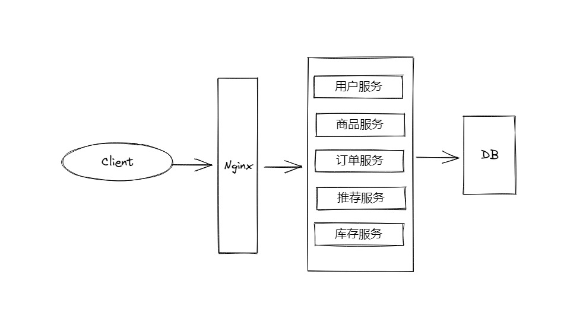
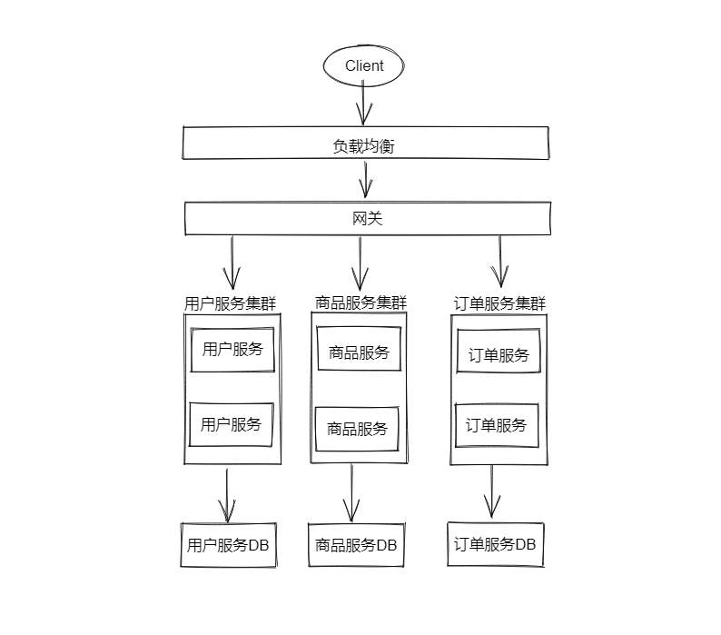
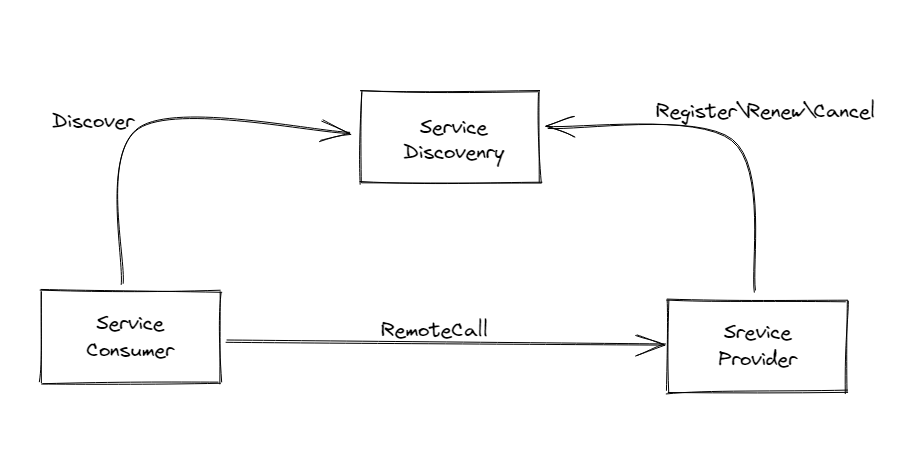
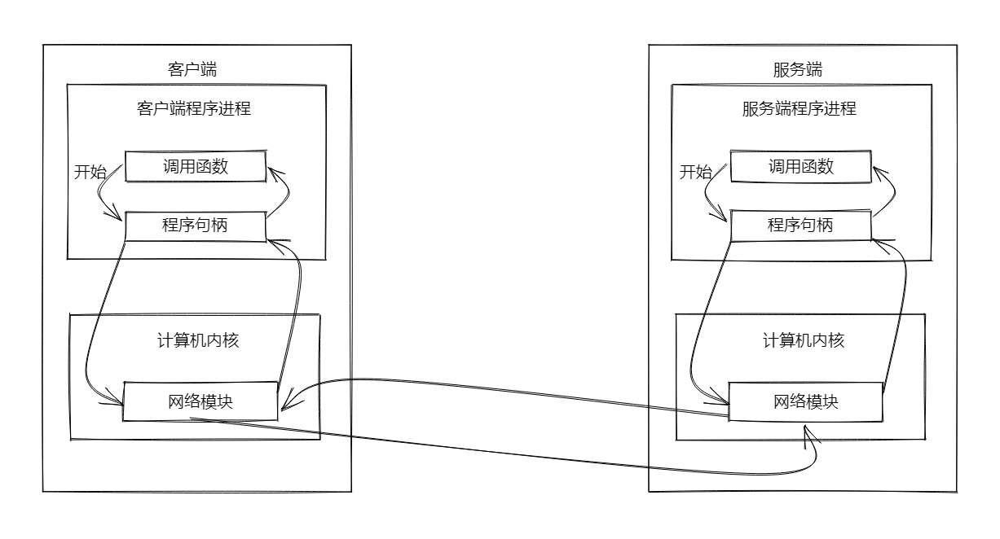
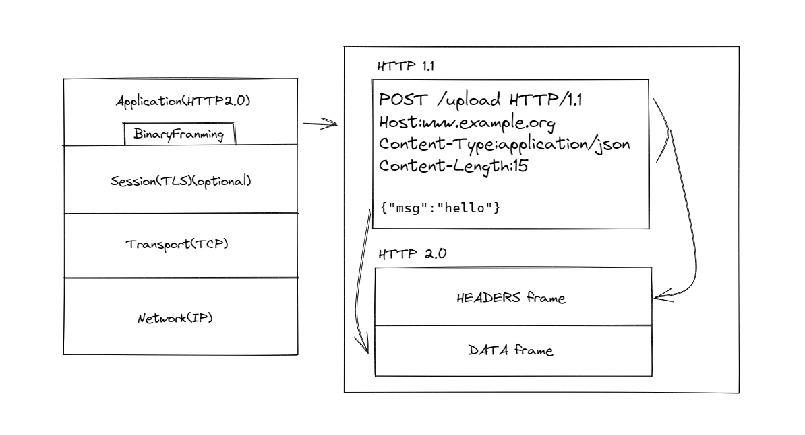

# gRPC教程


## 什么是微服务

### 单体架构



一些致命缺点：

1. 一旦某个服务宕机，会引起整个应用不可用，隔离性差
2. 只能整体应用进行伸缩，浪费资源，可伸缩性差
3. 代码耦合在一起，可维护性差

### 微服务架构

为解决单体架构的问题，这就需要将服务进行拆分，单独管理和维护



以上的架构，解决了单体架构的弊端

但是，同时也是引入了新的问题：

1. 代码冗余
2. 服务与服务之间存在调用关系

#### 代码冗余问题

服务未拆解之前，公告的功能有统一的实现，比如：认证、授权、限流等，但是服务拆解之后，每一个服务可能都要实现一遍

为此出现了以下的解决方案：

1. 由于为了保存对外提供的服务一致性，引入了网关的概念，由网关根据不同的请求，将其转发到不同的服务(路由功能)，由于入口的一致性，可以在网关实现公共的一些功能。    
2. 可以将公共的功能抽取出来，形成一个新的服务，比如统一认证中心。

#### 服务之间调用

服务拆解之后，服务于服务之间发生的是进程和进程之间的调用，服务器和服务器之间调用。

那么就需要发起网络调用，网络调用我们能立马的想起的就是http，但是在微服务框架中，http虽然便捷方便，但是性能较低，这时候就需要引入RPC（远程过程调用），通过自定义协议发起TCP调用，来加快传输效率。

每个服务由于可能分布在成千上百的机器上，服务和服务之间的调用，会出现一些问题，比如：如何找到应该调用哪台机器上的服务，调用方可能需要维护被调用方的地址，这个地址可能很多个，增加额外的负担，这个时候就需要引入服务治理。

服务治理中有一个重要的概念，服务发现，服务发现中有一个重要的概念，注册中心。



每个服务启动的时候，会将自身的服务和IP注册到注册中心，其他服务调用的时候，只需要向注册中心申请地址即可。

当然，服务和服务之间调用会发送一些问题，为了避免产生连锁的雪崩反应，引入服务容错，为了追踪一个调用所经过的服务，引入了链路追踪，等等这些就构建了一个微服务的生态。

## gRPC

gRPC是一款语言中立，平台中立，开源的远程过程调用系统，gRPC客户端和服务端可以在多种环境中允许和交互，比如Java写的服务端，可以用Go语言语言写客户端调用。

数据在进行网络传输的时候，需要进行序列化，序列化协议有很多种，比如xml、json、protobuf等…

gRPC默认使用protocol buffers，这是Google开源的一套成熟的结构数据序列化机制。

在学习gRPC之前，需要对protocol buffers有一个大致了理解。

序列化：将数据结构或对象转化成二进制串的过程。

反序列化：将在序列化过程中产生的二进制串转换成数据结构或对象的进程。

## protobuf

protobuf是Google开源的一种数据格式，适合高性能，对影响速度有要求的数据传输场景。因为protobuf是二进制数据格式，需要编码和解码。数据本身不具有可读性。因此只能反序列化之后得到的真正的可读的数据。

优势：

1. 序列化后体积相比JSON和XML很小，适合网络传输
2. 支持跨平台多语言
3. 消息格式升级和兼容性还不错
4. 序列化反序列化很快

劣势：

这个目前俺也不太清楚


### 安装

第一步：下载通用编译器

地址：[Releases · protocolbuffers/protobuf (github.com)](https://github.com/protocolbuffers/protobuf/releases)

根据不同的操作系统，下载不同的包

第二步：配置环境变量

第三步：安装Go专用的protoc的生成器

```bash
go get github.com/golang/protobuf/protoc-gen-go
```

如何使用protobuf：

1. 定义一种源文件，扩展名为`.proto`，使用这种源文件，可以定义存储类的内容(消息类型、格式)
2. protobuf有自己的编译器`protoc`，可以将`.proto`编译成对应语言的文件，就可以进行使用了

### hello world

假设现在需要传输用户的消息，其中有username和age两个字段

```protobuf
// 指点当前proto语法版本，有2和3版本
syntax = "proto3";
// option go_package = "path;name";   // path表示生成的go文件的存放位置，会自动生成目录  name表示生成的go文件所属的包名
option go_package = ".;./service";
package service;

massage User {
	string username = 1;
	int32 age = 2;
}
```

### proto文件    

#### message介绍

`message`：`protobuf`中定义了一个消息类型是通过关键字`message`字段指定的。

消息就是需要传输的数据格式的定义。

message关键字类似于C++ 中的class，Java中的class，go中的struct

例如：

```protobuf
message User {
	string username = 1;
	int32 age = 2;
}
```

在消息中承载的数据分别对应于每一个字段。

其中每个字段都有一个名字和一种类型。

#### 字段规则

`required`：消息体中必填字段，不设置会导致编码异常。

`optional`：消息体中可选字段。

`reqeated`：消息体中可重复字段，重复的值会顺序被保留，在go中重复的会被定义为切片。

```protobuf
message User{
    string username = 1;
    int32 age = 2;
    optional string password = 3;
    repeated string addresses = 4;
}
```

#### 字段映射

| .proto   | Notes                                                        | Go      | Ruby                 | C++    | Java       | Python         | C#         |
| -------- | ------------------------------------------------------------ | ------- | -------------------- | ------ | ---------- | -------------- | ---------- |
| double   |                                                              | float64 | Float                | double | double     | float          | double     |
| float    |                                                              | float32 | Float                | float  | float      | float          | float      |
| int32    | 使用变长编码对于负值的效力很低，如果你的域有，可能会有负值，请使用sint64代替 | int32   | Fixnum or Bignum     | int32  | int        | int            | int        |
| int64    |                                                              | int64   | Bignum               | int64  | long       | ing/long[3]    | long       |
| uint32   | 使用变长编码                                                 | uint32  | Fixnum or Bignum     | uint32 | int[1]     | int/long[3]    | uint       |
| uint64   | 使用变长编码                                                 | uint64  | Bignum               | uint64 | long[1]    | int/long[3]    | ulong      |
| sint32   | 使用变长编码，这些编码在负值时比int32高效得多                | int32   | Fixnum or Bignum     | int32  | int        | intj           | int        |
| sint64   | 使用变长编码，有符号的整形值。编码时通常得比int64高          | int64   | Bignum               | int64  | long       | int/long[3]    | long       |
| fixed32  | 总是4个字节，如果数值总是比总比228大的话，这个类型会比uint32高效 | uint32  | Fixnum or Bignum     | uint32 | int[1]     | int            | uint       |
| fixed64  | 总是8个字节，如果数值总是比总比256大的话，这个类型会比uint64高效 | uint64  | Bignum               | uint64 | long[1]    | int/long[3]    | ulong      |
| sfixed32 | 总是4个字节                                                  | int32   | Fixnum or Bignum     | int32  | int        | int            | int        |
| sfixed64 | 总是8个字节                                                  | int64   | Bignum               | int64  | long       | int/long[3]    | long       |
| bool     |                                                              | bool    | TrueClass/FalseClass | bool   | boolean    | boolean        | bool       |
| string   | 一个字符串必须是UTF-8编码或者7 - bit ASCII编码的文本         | string  | String(UTF-8)        | string | String     | str/unicode[4] | string     |
| bytes    | 可能包含任何顺序的字节数据                                   | []byte  | String(ASCII-8BIT)   | string | ByteString | str            | ByteString |

#### 默认值

protobuf3删除了protobuf2中用来设置默认值的default关键字，取而代之的是protobuf3为各类型定义的默认值，也就是约定的默认值，如下所示：

| 类型         | 默认值                                                       |
| ------------ | ------------------------------------------------------------ |
| bool         | false                                                        |
| 整形         | 0                                                            |
| string       | 空字符串“”                                                   |
| 枚举类型enum | 第一个枚举元素值，因为Protobuf3强制要求第一个枚举元素的值必须是0，所以枚举的默认值就是0 |
| message      | 不是nill，而是DEFAULT_INSTANCE                               |

#### 标识号

`标识符`：在消息体的定义中，每个字段都必须要有唯一的标识号，标识号是[0,2^29-1]范围内的一个整数

```protobuf
message Person {
	string name = 1;
	int32 id = 2;
	optional string email = 3;
	repeated string phones = 4;
}
```

以Person为例，name=1，id=2，email=3，phpnes=4中1-4就是标识号。

#### 定义多个消息类型

一个proto文件可以定义多个消息类型

```protobuf
message UserRequest {
	string name = 1;	
	int32 id = 2;
	optional string email = 3;
	repeated string phones = 4;
}

message UserResponse {
	string name = 1;
	int32 id = 2;
	optional string email = 3;
	repeated string phones = 4;
}
```

#### 嵌套消息

可以其他消息类型中定义、使用消息类型，在下面的例子中，Person消息就定义在PersonInfo消息内，如下所示：

```protobuf
message PersonInfo {
	message Person {
		string name = 1;
		int32 height = 2;
		repeated int32 weight = 3;
	}
	repedted Person info = 1;
}
```

如果是在它的父消息类型的外部重用这个消息类型，则需要以PersonInfo.Persond的形式去使用它，如下所示：

```protobuf
message PersonMessage {
	PersonInfo.Person info = 1;
}
```

当然也可以将消息嵌套任意多层，如下所示：

```protobuf
message Grandpa {				// Level 0
	message Father {			// Level 1
		message son {			// Level 2
			string name = 1;
			int32 age = 2;
		}
	}
	message Uncle {				// Level 1
		message Son {			// Level 2
			string name = 1;
			int32 age = 2;
		}
	}
}
```

#### 服务定义(Service)

如果想要将消息类型用在gRPC系统中，可以在.proto文件中定义一个RPC服务接口，protocol buffer 编译器将会根据所选择的不同语言生成服务接口以及存根。

```protobuf
service SrarchService {
	// rpc 服务的函数名 (传入参数) 返回 (返回参数)
	rpc Search (SearchRequest) returns (SearchResponse);
}
```

上述代表标识，定义了一个RPC服务，该方法接收SearchRequest返回SearchResponse

## gRPC实例

### RPC和gRPC介绍

RPC（Remote Procedure Call）远程过程调用协议，一种通过网络从远程计算机上请求服务，而不需要了解底层网络技术的协议，RPC它假定某些协议的存在，例如TCP/UDP等，为通信程序之间携带的数据。

在OSI网络七层模型中，RPC跨域了传输层和应用层，RPC使得开发，包括网络分布式多程序在内得应用程序更加容易

过程是什么？过程是业务处理、计算任务，更直白的说，就是程序，就是像调用本地方法一样调用远程的过程。

RPC采用客户端/服务端的模式，通过request-resoinse消息模式实现	



gRPC里客户端应用可以像调用吧本地对象一样直接调用另外一台不同的计算上服务端应用的方法，使得我们我们能够更容易得创建分布式应用和服务。与需要RPC系统类似，也是基于以下理念，定义一个服务，指定其能够被远程调用得方法（包含参数得返回类型）。在服务端实现这个接口，并允许一个gRPC服务器来处理客户端调用。在客户端拥有一个存根能够像服务端一样的方法。


官方网站：https://grpc.io

底层协议：

- HTTP2：https://github.com/grpc/grpc/blob/master/doc/PROTOCOL-HTTP2.md
- GRPC-WEB：https://github.com/grpc/grpc/blob/master/doc/PROTOCOL-WEB.md

#### HTTP2



- HTTP/1里header对于HTTP/2里的HEADERS frame
- HTTP/1里的payload对于HTTP/2里的DATA frame

gRPC把元数据放到HTTP/2 Headers里，请求参数序列化之后放到Data frame里

基于HTTP/2协议的优点

1. 公开标准
2. HTTP/2 的前身是Google的SPDY，有经过实践检验
3. HTTP/2 天然支持物联网、手机、浏览器
4. 基于HTTP/2 多语言客户端实现容易
   1. 每个练习的编程语言都会有成熟额HTTP/2 Client
   2. HTTP/2 Client是经过充分尝试，可靠的
   3. 用Client发送HTTP/2 请求的难度远低于用socket发送数据包/解析数据包
5. HTTP/2 支持Stream 和流控
6. 基于HTTP/2在Gateway/Proxy 很容易支持
   1. Nginx 和Envot 都支持
7. HTTP/2 安全性有保证
   1. HTTP/2 天然支持SSL，当然gRPC可以跑在clear text 协议（即不加密）上。
   2. 很多私有协议的RPC可能自己保障了一层TLS 支持，使用起来非常复杂。开发者是否有足够的安全知识？使用者是否配置对了？运维者是否能够正确理解？
   3. HTTP/2 在公有网络上的传输上有保障，比如这个CRIME 攻击，私有协议很难保证没有这样子的漏洞。
8. HTTP/2 鉴权成熟
   1. 从HTTP/1 发展起来的鉴权系统已经很成熟，可以无缝用到HTTP/2 上。
   2. 可以从前端到后端完全打通的鉴权，不需要做任何转换适应。

基于HTTP/2 协议的缺点

- RPC 的元数据的传输不够高效

  经过HPAC 可以压缩HTTP Header，但是对于RPC 来说，前端一个函数调用，可以简化为一个int，只要两端去协商过一次，后面直接查表就可以了，不需要像HPACC那样编码解码。

  可以考虑专门针对gRPC 做一个优化过的HTTP/2 解析器，较少一些通用的处理，感觉是可以在一定程度上提升性能。

- HTTP/2 里一次gRPC调用需要要两次解码

  一次是Headers Frame，一次是Data Frame。

- HTTP/2 标准本身是只有一个TCP连接，但是实际在gRPC里是会有多个TCP 连接，使用时需要注意。

**gRPC 基于HTTP/2 那么它的性能肯定不会是最顶尖的。但是对于RPC 来说中庸的QPS可以接受，通用和兼容性才是最重要的事情。**

- 官方的benchmark：https://grpc.io/docs/guides/benchmarking.html
- https://github.com/hank-whu/rpc-benchmark

gRPC目前是k8s生态里的事实标准，而Kubernetes又是容器编排的事实标准。gRPC已经广泛应用于Istio体系，包括:

- Envoy与Pilot(现在叫istiod)间的XDS协议
- mixer的handler扩展协议
- MCP(控制面的配置分发协议)

在Cloud Native的潮流下，开放互通的需求必然会产生基于HTTP/2的RPC。

#### 实例

##### 服务端

##### 客户端
